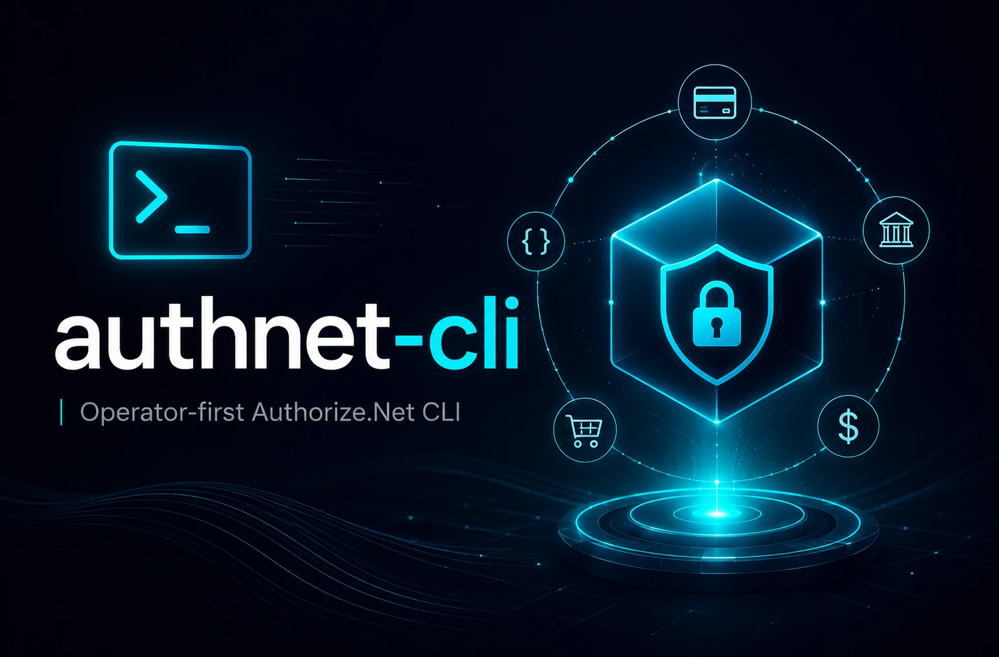

<p align="center">
  
</p>

# authnet-cli

`authnet-cli` is an Authorize.Net operations CLI. The executable is `authnet`.

The primary goal of this project is a safe, easy-to-use command line tool for inspecting Authorize.Net state across sandbox and production profiles, with well-formatted output for humans and stable JSON output for automation and agents.

**What it is:** A tool to help automate builds and integration tests, as well as allow human operators a convenient way to inspect and work with gateway data.

**What it isn't:** An SDK wrapper, raw API tunnel, MCP server, or compliance product.

To be clear:

> `authnet-cli` makes no guarantees regarding compliance with PCI-DSS, GDPR or any other standard.

That said, we do employ significant measures to make `authnet-cli` as safe as possible to use in any environment.

## Security

Current 0.x.x versions allow explicit production reads and exclude production writes. Sandbox helper commands contact the real Authorize.Net sandbox gateway for known test-card scenarios. Production mutation commands are not yet available, though they are on the roadmap for a future release.

**Sensitive output is redacted by default.** The CLI does not write sensitive payment data or customer PII through CLI-controlled persistence, e.g. logs or other durable targets.

See the [safety model](docs/safety-model.md) for more details.

## Installation

The latest published CLI release is available on [GitHub Releases](https://github.com/EnzanNoMetsuke/authnet-cli/releases/latest), which are the canonical source for release binaries, checksums, and release notes. Download the archive for your platform from the release page and verify the checksum before running the binary.

amd64 & arm64 binaries are available for:

- macOS
- Linux
- Windows

> NOTE: Linux & Windows binaries are currently untested; feedback is welcome. Feel free to file an issue and report your experience if something isn't working for you.

### Homebrew

The unsigned Homebrew cask is available from the Exigentix tap:

```sh
brew tap Exigentix/tap
brew install --cask authnet
authnet --version
```

See the [release process](docs/release.md) for artifact, checksum, changelog, and Homebrew tap details.

**NOTE:** `authnet` is currently unsigned and not notarized on macOS. macOS may block first launch of a downloaded release binary. Verify the release checksum before removing quarantine metadata. If you choose to trust the installed `authnet` binary after verification, remove the quarantine attribute with:

```sh
xattr -dr com.apple.quarantine "$(realpath "$(command -v authnet)")"
```

## Commands

The current canonical command surfaces are:

```text
authnet --version
authnet version
authnet paths
authnet config validate
authnet config migrate
authnet auth test
authnet profile list
authnet profile setup
authnet profile remove
authnet transaction get
authnet transaction list
authnet transaction unsettled list
authnet customer-profile get
authnet customer-profile list
authnet response-code explain
authnet sandbox charge approved
authnet sandbox charge declined
authnet sandbox charge avs
authnet sandbox charge cvv
authnet sandbox charge duplicate
authnet completion ...
```

Production reads must use an explicit production profile. A default profile may exist only for sandbox-classified profiles.

## Profiles

**Profiles are named Authorize.Net access targets.** Each profile records a visible profile name, an environment classification (`sandbox` or `production`), and non-secret credential-source references. Commands use profiles to keep sandbox and production access explicit; production profiles must always be selected with `--profile`, while **only sandbox profiles may be made the default**.

> ⚠️ Do not put secrets, customer PII, client names, or sensitive merchant labels in profile names. Profile names are visible in normal output and JSON envelopes.

Configure profiles with `authnet profile setup`:

```sh
authnet profile setup \
  --name sandbox-main \
  --environment sandbox \
  --api-login-id-env AUTHNET_API_LOGIN_ID \
  --transaction-key-env AUTHNET_TRANSACTION_KEY \
  --default
```

For production, omit `--default` and select the profile explicitly when running commands:

```sh
authnet --profile prod-main transaction get TRANSACTION_ID
```

Profile metadata is stored in `config.yaml` under the config directory shown by `authnet paths`. You can also edit that file directly:

```yaml
default_profile: sandbox-main
profiles:
  - name: sandbox-main
    environment: sandbox
    credential_source:
      type: env
      api_login_id_env: AUTHNET_API_LOGIN_ID
      transaction_key_env: AUTHNET_TRANSACTION_KEY
  - name: prod-main
    environment: production
    credential_source:
      type: env
      api_login_id_env: AUTHNET_PROD_API_LOGIN_ID
      transaction_key_env: AUTHNET_PROD_TRANSACTION_KEY
```

`config.yaml` stores non-secret metadata only. Current gateway commands read environment credential sources. Secure local credential references (e.g. from macOS Keychain) may be recorded as profile metadata, but gateway commands cannot read those references yet — this is planned for a future release.

Older pre-release installs may still have `profiles.json`. Run `authnet config migrate` to create `config.yaml` and retain the old JSON as `DEPRECATED-profiles.json`, which can be deleted after review.

### Profile Nuances

Raw gateway response output is sandbox-only and explicit. Supported commands are:

```sh
authnet --raw-response --profile sandbox-main auth test
authnet --raw-response --profile sandbox-main transaction get TRANSACTION_ID
```

Production profiles and unsupported commands are denied before raw gateway output is emitted.

Sandbox charge helpers are sandbox-only and use test-card aliases instead of raw card-number entry:

```sh
authnet sandbox charge approved --card visa --amount 12.34
authnet sandbox charge avs --variant no-match --amount 12.34
authnet sandbox charge cvv --variant no-match --amount 12.34
authnet sandbox charge duplicate --amount 12.34 --window 120
```

## User Preferences

Non-secret user preferences live in `config.yaml` under the resolved config directory shown by `authnet paths`. Supported preferences include default color behavior and transaction list sorting:

```yaml
preferences:
  color: auto
  transaction_list:
    sort_by: timestamp
    sort_order: descending
```

Supported color values are `auto`, `always`, and `never`. Transaction lists support `sort_by` values `timestamp`, `transaction_id`, and `amount`, plus `sort_order` values `ascending` and `descending`. Explicit flags such as `--color=always`, `--no-color`, `--sort-by`, and `--sort-order` override persisted preferences for one invocation. `AUTHNET_TX_SORT_BY` and `AUTHNET_TX_SORT_ORDER` override transaction list preferences when flags are not provided. `--automation` always forces JSON output with no color.

## Local Development

Clone the repository and build the binary:

```sh
git clone https://github.com/EnzanNoMetsuke/authnet-cli.git
cd authnet-cli && make build
./bin/authnet version
```

Install the pinned linter and Git hooks:

```sh
make golangci-lint-install
make install-git-hooks
```

Run the full local verification set:

```sh
GOTMPDIR="$PWD/.cache/go-tmp" make verify
```

Run opt-in live sandbox integration tests only with sandbox credentials:

```sh
AUTHNET_API_LOGIN_ID="<sandbox-api-login-id>" \
AUTHNET_TRANSACTION_KEY="<sandbox-transaction-key>" \
GOTMPDIR="$PWD/.cache/go-tmp" \
make test-sandbox-integration
```

Contributor expectations are documented in [CONTRIBUTING.md](CONTRIBUTING.md). Agent and automation usage is documented in [docs/agent-usage.md](docs/agent-usage.md). Sandbox integration CI is documented in [docs/sandbox-integration-ci.md](docs/sandbox-integration-ci.md). Release workflow details are documented in [docs/release.md](docs/release.md). Response-code reference maintenance is documented in [docs/response-code-reference.md](docs/response-code-reference.md).

## License

`authnet-cli` is released under the MIT License. 

See [LICENSE](LICENSE) for the full license text and [TRADEMARK](TRADEMARK.md) for the full trademark policy.

- **Code:** The source code, configuration files, and documentation in this repository are available under the MIT License. You are free to use, modify, and distribute the code as long as you include the original copyright notice.
- The "authnet-cli" name, the "authnet-cli" brand, and the "authnet-cli" logo are trademarks of Exigentix LLC and are **not** covered by the MIT License.
